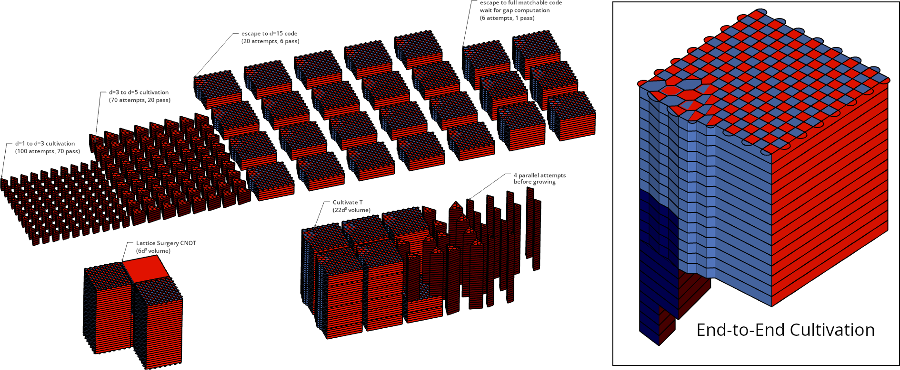
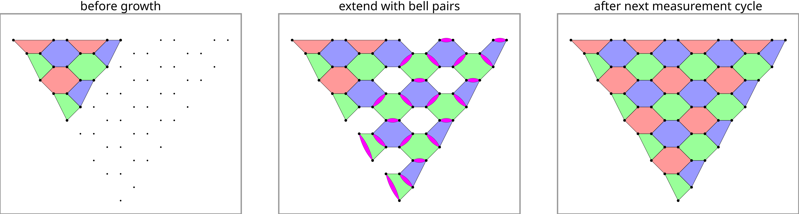
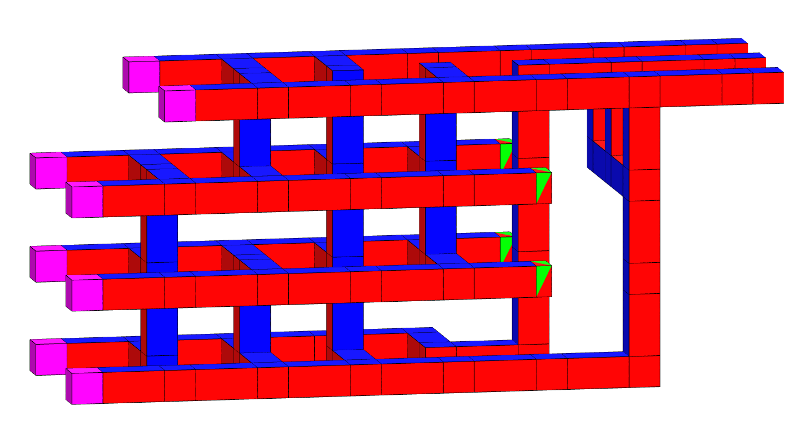

Code for the paper "Magic state cultivation: growing T states as cheap as CNOT gates"
=====================================================================================



## Usage: recollecting statistics and regenerating plots

These instructions assume you are on a linux system.
They were tested on a Debian distribution (specifically gLinux).

Step 0: install system and python dependencies, then confirm unit tests pass.

```bash
sudo apt install parallel
pip install -r requirements.txt
```

```bash
pytest src
```

Step 1: generate circuits tested by the paper.

```bash
./step1_make_circuits
```

Step 2: collect statistics from the circuits generated in step 1.

```bash
# Note: this script will appear to do nothing, because it sees that the data is already
# collected and stored in the `assets/` directory. Delete `assets/stats.csv` or change
# `--save_resume_filepath` arguments to force recollection.
#
# Warning: recollecting these statistics will take weeks. Or months.
# You can reduce the time by editing `step2_collect` to use smaller values of
# `--max_shots` or `--max_errors`.
./step2_collect
```

Step 3: generate various plots from the data collected in step 2.

```bash
./step3_plot
```

## Usage: generating a custom circuit

```bash
./tools/make_circuits \
    --circuit_type end2end-inplace-distillation \
    --noise_strength 0.001 \
    --gateset css \
    --out_dir out \
    --basis Y \
    --d1 3 5 \
    --d2 "d1*2+1" \
    --r1 "d1" \
    --r2 5
```

Add `--debug` to also generate an html file containing a circuit viewer.

Available circuit types are:

- `end2end-inplace-distillation`: Full construction, including the injection stage and the cultivation stage and the escape stage, ending in a large grafted matchable code.
- `escape-to-big-matchable-code`: Just the escape stage, without injection or cultivation. 
- `inject[teleport]+cultivate`: Injection and cultivation without escape, with the initial T state injected by creating a degenerate color code then measuring out the extra qubit in the T basis.
- `inject[bell]+cultivate`: Injection and cultivation without escape, with the initial T state injected by growing the color code with Bell pairs from d=1 to d=3.
- `inject[unitary]+cultivate`: Injection and cultivation without escape, with the initial T state injected unitarily. 
- `idle-matchable-code`: Idling circuit using the grafted matchable code that the escape stage ends in.
- `surface-code-memory`: Idling circuit using the surface code.
- `surface-code-cnot`: A lattice surgery surface code cnot, for scale.
- `escape-to-big-color-code`:
    Color code circuit growing from d1 to d2 by preparing Bell pairs.
    > 


## Repository layout

- [`assets/`](assets/): Assets created for the paper, like images and 3d models.
    - [`assets/gen/`](assets/gen/): Assets generated by running `./step3_plot`.
- `out/`: Ignored by git but various tools (like `./step1_make_circuits`) store their output under here.
- [`src/`](src/): Source code directory
    - [`src/cultiv/`](src/cultiv/): Python utilities for generating and testing the circuits reported in the paper.
        - [`src/cultiv/_construction/`](src/cultiv/_construction/): Code for generating tested circuits.
        - [`src/cultiv/_decoding/`](src/cultiv/_decoding/): Code for decoding shots from tested circuits.
    - [`src/gen/`](src/gen/): Python utilities for creating circuit chunks and compiling them into full circuits.
    - [`src/latte/`](src/latte/): Python utilities for testing magic state distillation factories built out of lattice surgery.
- [`tools/`](tools/): Bash scripts for performing tasks like generating circuit files, from the command line.
- [`testdata/`](testdata/): Data used by unit tests.
    - [`testdata/factory_scripts/`](testdata/factory_scripts/): Specifies various magic state distillation factories as a series of pauli product actions. Unit tests iterate through each file to verify correctness.
    - [`testdata/surgery_scripts/`](testdata/surgery_scripts/): Specifies various magic state distillation factories as text diagrams of layers of lattice surgery with feedback annotations. Unit tests iterate through each file to verify correctness.
        - [`testdata/surgery_scripts/ccz_4x3_7_tels.lat`](testdata/surgery_scripts/ccz_4x3_7_tels.lat):
            The lattice surgery factory included in the paper's bonus figures.
            > 